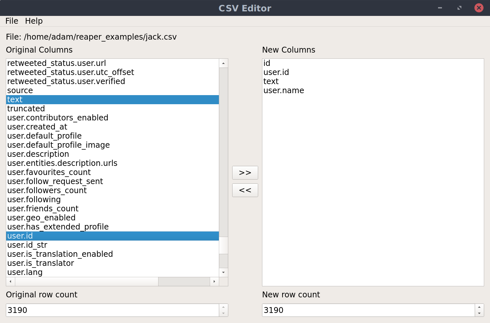

# CSV Editor

CSV Editor lets you remove multiple columns in CSV files

## Download

Download CSV Editor from the list of releases [here](https://github.com/ScriptSmith/csveditor/releases)

## Guide

1. Open your csv file

   *`File` -> `Open`*

2. Select the columns that you want to keep

     *Windows: `Ctrl` + Click and `Ctrl` + `Shift` + Click*

     *macOS: `⌘` + Click and `⌘` + `Shift` + Click*

3. Click the `>>` button

   *If you want to delete columns from the list of new columns, select them and click the `<<` button*

4. If you want to change the order of the new columns, drag them within the list

5. If you want to limit the number of rows in the new csv file, decrease the `New row count`

6. Save the new csv file. The new file will contain only the columns specified in the list of `New Columns`

   `File` -> `Save`

   *The file is finished saving when the new row count matches the original row count, or when the new row count is the same as the decreased row count you specified earlier*

7. Done

## About

This program was written by Adam Smith in Python using PyQt5. It relies on Python's inbuilt csv library

It is licensed under the GPL. See [LICENSE.txt](LICENSE.txt) for details
